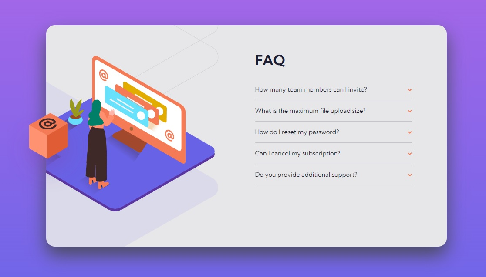

# Frontend Mentor - FAQ accordion card solution

This is a solution to the [FAQ accordion card challenge on Frontend Mentor](https://www.frontendmentor.io/challenges/faq-accordion-card-XlyjD0Oam). Frontend Mentor challenges help you improve your coding skills by building realistic projects.

## Table of contents

- [Overview](#overview)
  - [The challenge](#the-challenge)
  - [Screenshot](#screenshot)
  - [Links](#links)
- [My process](#my-process)
  - [Built with](#built-with)
  - [What I learned](#what-i-learned)
  - [Continued development](#continued-development)
- [Author](#author)

## Overview

### The challenge

Users should be able to:

- View the optimal layout for the component depending on their device's screen size
- See hover states for all interactive elements on the page
- Hide/Show the answer to a question when the question is clicked

### Screenshot

### Links

- Solution URL: [https://github.com/wavegate/faq-accordion-card-main](https://github.com/wavegate/faq-accordion-card-main)
- Live Site URL: [https://deft-tiramisu-a52a92.netlify.app/](https://deft-tiramisu-a52a92.netlify.app/)

## My process

### Built with

- Semantic HTML5 markup
- CSS custom properties
- Flexbox

### What I learned

- Stacking multiple background images on top of each other, using pseudo elements to add a background element that can go out of the element.
- You can create a drop shadow on the background of a pseudoelement with filter(dropshadow). I did not expect this to be possible!
- Using label and checkbox for a no-JavaScript accordion.
- I also decided to stop being too strict on the exact sizing of objects as I was getting really tired trying to match typography and padding perfectly. I decided as long as it was functionally effective I would be fine with it.

### Continued development

I'm not sure what the best way to deal with height changes necessary to accommodate for opening up accordions should be dealt with, as I know it can shift the whole page down in a more complicated web page.

## Author

- Website - [wavegate](https://github.com/wavegate)
- Frontend Mentor - [@wavegate](https://www.frontendmentor.io/profile/wavegate)
